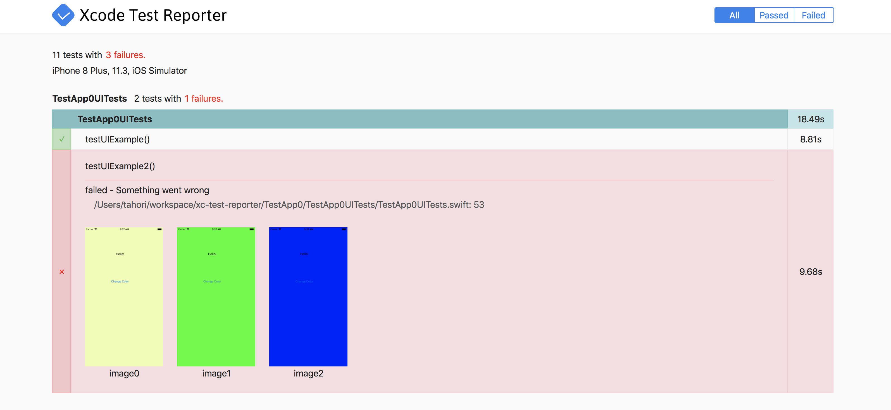

<div align="center"></div>

<div align="center">

[](http://makeapullrequest.com)
[](https://travis-ci.org/taisukeh/xcode-test-reporter)


</div>

The `Xcode Test Reporter` Generates JUnit or HTML report from Xcode `plist` test report files.

HTML report sample:


## Prerequisites

Supported platforms:
- macOS 10.12 (High Sierra) or higher

## Installing

You can use Homebrew:
```
brew tap taisukeh/xcode-test-reporter
brew install xcode-test-reporter
```

Or download from [GitHub releases](https://github.com/taisukeh/xcode-test-reporter/releases).

## Usage

You can use as follows:
```
xcode-test-reporter --format html,junit --path ~/Library/Developer/Xcode/DerivedData/MyApp-*/Logs/Test  --output-directory myreport
```

Options:
- `path`: Path containing the plist files. Current directory by default.
- `output-directory`: Directoy in which the report files should be written to.  Same directory as source by default.
- `format`: The report format to output for (one of 'html', 'junit', or comma-separated values). JUnit by default.

## Fastlane plugin

You can use as a fastlane action. See [fastlane-plugin-xcode_test_reporter](https://github.com/taisukeh/fastlane-plugin-xcode_test_reporter).

## VS.

- [trainer](https://github.com/KrauseFx/trainer) - `trainer` is developed by @KrauseFx who is the author of [fastlane](https://github.com/KrauseFx/trainer), and it works well fastlane. `Xcode Test Reporter` can generate HTML report while `trainer` can generate only JUnit report.

## Contributing

Issues or PRs are welcome.

## Authors

* **HORI Taisuke** - *Initial work* - [taisukeh](https://github.com/taisukeh)

## License

This project is licensed under the MIT License - see the [LICENSE](LICENSE) file for details
